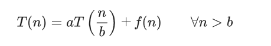
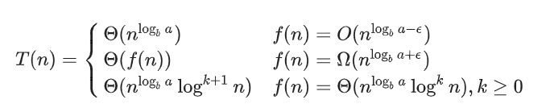
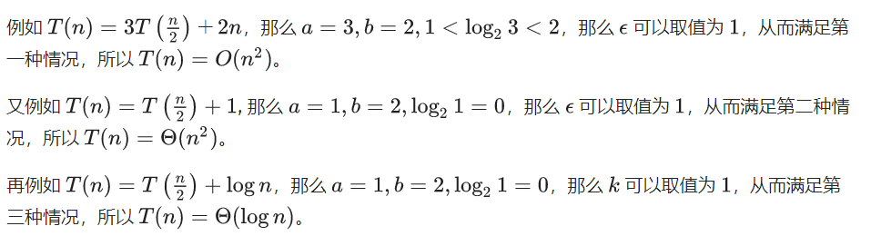

list += string  : extend string and add each char in string to list

`lis = [1, 2, 3]`

`lis += "123"`  make lis become `[1, 2, 3, '1', '2', '3']`

if doing this with another list:

`lis += ["123"]` make lis become `[1, 2, 3, "123"]`


list multiply:

lis = [1, 2, 3]

lis *= 3 will generate: [1, 2, 3, 1, 2, 3, 1, 2, 3]

however: 

lis = [[1, 2, 3]] then lis *= 3 will generate: lis contains 3 same object [1, 2, 3],

so it is recommend to use for loop to create multi-dimensional lists!! 列表的乘法只是拷贝引用, 修改其内容时会导致所有数组都被修改.


```python
# headlines.py

def headline(text: str, align: bool = True) -> str:
    if align:
        return f"{text.title()}\n{'-' * len(text)}"
    else:
        return f" {text.title()} ".center(50, "o")

print(headline("python type checking"))
print(headline("use mypy", align=True))
```

## 装饰器

装饰器是一个函数，接受一个函数或方法作为其唯一的参数，并返回一个新函数或方法，其中整合了修饰后的函数或方法，并附带了一些额外的功能。简而言之，可以在不修改函数代码的情况下，增加函数的功能

部分装饰器在竞赛中非常实用，比如 [`lru_cache`](https://docs.python.org/3/library/functools.html#functools.lru_cache)，可以为函数自动增加记忆化的能力，在递归算法中非常实用：

```
@lru_cache(maxsize=128,typed=False)
```

-   传入的参数有 2 个：`maxsize` 和 `typed`，如果不传则 `maxsize` 的默认值为 128，`typed` 的默认值为 `False`。
-   其中 `maxsize` 参数表示的是 LRU 缓存的容量，即被装饰的方法的最大可缓存结果的数量。如果该参数值为 128，则表示被装饰方法最多可缓存 128 个返回结果；如果 `maxsize` 传入为 `None` 则表示可以缓存无限个结果。
-   如果 `typed` 设置为 `True`，不同类型的函数参数将被分别缓存，例如，`f(3)` 和 `f(3.0)` 会缓存两次。

以下是使用 `lru_cache` 优化计算斐波那契数列的例子：

```python
@lru_cache(maxsize=None)
def fib(n):
    if n < 2:
        return n
    return fib(n-1) + fib(n-2)
```


进行时间复杂度计算时，哪些变量被视作输入规模是很重要的，而**所有和输入规模无关的量都被视作常量，计算复杂度时可当作1来处理**。


## 主定理 (Master Theorem)

我们可以使用 Master Theorem 来快速求得关于递归算法的复杂度。 Master Theorem 递推关系式如下



那么



需要注意的是，这里的第二种情况还需要满足 regularity condition, 即a*f(n/b) <=  c\*f(n)，for some constant k < 1 and sufficiently large n。

证明思路是是将规模为n 的问题，分解为 a个规模为 n/b的问题，然后依次合并，直到合并到最高层。每一次合并子问题，都需要花费f(n) 的时间。




