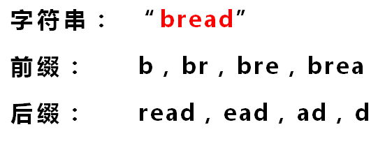
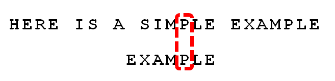
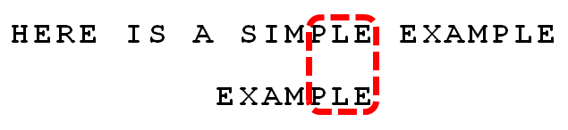
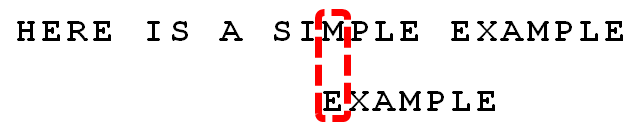

# 字符串匹配的KMP算法

https://www.ruanyifeng.com/blog/2013/05/)

[字符串匹配](https://en.wikipedia.org/wiki/String_searching_algorithm)是计算机的基本任务之一。

举例来说，有一个字符串"BBC ABCDAB ABCDABCDABDE"，我想知道，里面是否包含另一个字符串"ABCDABD"？

许多算法可以完成这个任务，[Knuth-Morris-Pratt算法](https://en.wikipedia.org/wiki/Knuth–Morris–Pratt_algorithm)（简称KMP）是最常用的之一。它以三个发明者命名，起头的那个K就是著名科学家Donald Knuth。

这种算法不太容易理解，网上有很多[解释](https://www.google.com/search?q=Knuth-Morris-Pratt+algorithm)，但读起来都很费劲。直到读到[Jake Boxer](http://jakeboxer.com/blog/2009/12/13/the-knuth-morris-pratt-algorithm-in-my-own-words/)的文章，我才真正理解这种算法。下面，我用自己的语言，试图写一篇比较好懂的KMP算法解释。

1.

首先，字符串"BBC ABCDAB ABCDABCDABDE"的第一个字符与搜索词"ABCDABD"的第一个字符，进行比较。因为B与A不匹配，所以搜索词后移一位。

2.

因为B与A不匹配，搜索词再往后移。

3.

就这样，直到字符串有一个字符，与搜索词的第一个字符相同为止。

4.

接着比较字符串和搜索词的下一个字符，还是相同。

5.

直到字符串有一个字符，与搜索词对应的字符不相同为止。

6.

这时，最自然的反应是，将搜索词整个后移一位，再从头逐个比较。这样做虽然可行，但是效率很差，因为你要把"搜索位置"移到已经比较过的位置，重比一遍。

7.

一个基本事实是，当空格与D不匹配时，你其实知道前面六个字符是"ABCDAB"。KMP算法的想法是，设法利用这个已知信息，不要把"搜索位置"移回已经比较过的位置，继续把它向后移，这样就提高了效率。

8.

怎么做到这一点呢？可以针对搜索词，算出一张《部分匹配表》（Partial Match Table）。这张表是如何产生的，后面再介绍，这里只要会用就可以了。

9.

已知空格与D不匹配时，前面六个字符"ABCDAB"是匹配的。查表可知，最后一个匹配字符B对应的"部分匹配值"为2，因此按照下面的公式算出向后移动的位数：

>   　　移动位数 = 已匹配的字符数 - 对应的部分匹配值

因为 6 - 2 等于4，所以将搜索词向后移动4位。

10.

因为空格与Ｃ不匹配，搜索词还要继续往后移。这时，已匹配的字符数为2（"AB"），对应的"部分匹配值"为0。所以，移动位数 = 2 - 0，结果为 2，于是将搜索词向后移2位。

11.

因为空格与A不匹配，继续后移一位。

12.

逐位比较，直到发现C与D不匹配。于是，移动位数 = 6 - 2，继续将搜索词向后移动4位。

13.

逐位比较，直到搜索词的最后一位，发现完全匹配，于是搜索完成。如果还要继续搜索（即找出全部匹配），移动位数 = 7 - 0，再将搜索词向后移动7位，这里就不再重复了。

14.

下面介绍《部分匹配表》是如何产生的。

首先，要了解两个概念："前缀"和"后缀"。 "前缀"指除了最后一个字符以外，一个字符串的全部头部组合；"后缀"指除了第一个字符以外，一个字符串的全部尾部组合。

15.

"部分匹配值"就是"前缀"和"后缀"的最长的共有元素的长度。以"ABCDABD"为例，

>   　　－　"A"的前缀和后缀都为空集，共有元素的长度为0；
>
>   　　－　"AB"的前缀为[A]，后缀为[B]，共有元素的长度为0；
>
>   　　－　"ABC"的前缀为[A, AB]，后缀为[BC, C]，共有元素的长度0；
>
>   　　－　"ABCD"的前缀为[A, AB, ABC]，后缀为[BCD, CD, D]，共有元素的长度为0；
>
>   　　－　"ABCDA"的前缀为[A, AB, ABC, ABCD]，后缀为[BCDA, CDA, DA, A]，共有元素为"A"，长度为1；
>
>   　　－　"ABCDAB"的前缀为[A, AB, ABC, ABCD, ABCDA]，后缀为[BCDAB, CDAB, DAB, AB, B]，共有元素为"AB"，长度为2；
>
>   　　－　"ABCDABD"的前缀为[A, AB, ABC, ABCD, ABCDA, ABCDAB]，后缀为[BCDABD, CDABD, DABD, ABD, BD, D]，共有元素的长度为0。

16.

"部分匹配"的实质是，有时候，字符串头部和尾部会有重复。比如，"ABCDAB"之中有两个"AB"，那么它的"部分匹配值"就是2（"AB"的长度）。搜索词移动的时候，第一个"AB"向后移动4位（字符串长度-部分匹配值），就可以来到第二个"AB"的位置。

# 字符串匹配的Boyer-Moore算法

https://www.ruanyifeng.com/blog/2013/05/)

上一篇文章，我介绍了[KMP算法](https://www.ruanyifeng.com/blog/2013/05/Knuth–Morris–Pratt_algorithm.html)。

但是，它并不是效率最高的算法，实际采用并不多。各种文本编辑器的"查找"功能（Ctrl+F），大多采用[Boyer-Moore算法](https://en.wikipedia.org/wiki/Boyer–Moore_string_search_algorithm)。

Boyer-Moore算法不仅效率高，而且构思巧妙，容易理解。1977年，德克萨斯大学的Robert S. Boyer教授和J Strother Moore教授发明了这种算法。

下面，我根据Moore教授自己的[例子](https://www.cs.utexas.edu/~moore/best-ideas/string-searching/fstrpos-example.html)来解释这种算法。

1.

假定字符串为"HERE IS A SIMPLE EXAMPLE"，搜索词为"EXAMPLE"。

2.

首先，"字符串"与"搜索词"头部对齐，从尾部开始比较。

这是一个很聪明的想法，因为如果尾部字符不匹配，那么只要一次比较，就可以知道前7个字符（整体上）肯定不是要找的结果。

我们看到，"S"与"E"不匹配。这时，**"S"就被称为"坏字符"（bad character），即不匹配的字符。**我们还发现，"S"不包含在搜索词"EXAMPLE"之中，这意味着可以把搜索词直接移到"S"的后一位。

3.

依然从尾部开始比较，发现"P"与"E"不匹配，所以"P"是"坏字符"。但是，"P"包含在搜索词"EXAMPLE"之中。所以，将搜索词后移两位，两个"P"对齐。

4.

我们由此总结出**"坏字符规则"**：

>   　　后移位数 = 坏字符的位置 - 搜索词中的上一次出现位置

如果"坏字符"不包含在搜索词之中，则上一次出现位置为 -1。

以"P"为例，它作为"坏字符"，出现在搜索词的第6位（从0开始编号），在搜索词中的上一次出现位置为4，所以后移 6 - 4 = 2位。再以前面第二步的"S"为例，它出现在第6位，上一次出现位置是 -1（即未出现），则整个搜索词后移 6 - (-1) = 7位。

5.

依然从尾部开始比较，"E"与"E"匹配。

6.

比较前面一位，"LE"与"LE"匹配。

7.

比较前面一位，"PLE"与"PLE"匹配。

8.

比较前面一位，"MPLE"与"MPLE"匹配。**我们把这种情况称为"好后缀"（good suffix），即所有尾部匹配的字符串。**注意，"MPLE"、"PLE"、"LE"、"E"都是好后缀。

9.

比较前一位，发现"I"与"A"不匹配。所以，"I"是"坏字符"。

10.

根据"坏字符规则"，此时搜索词应该后移 2 - （-1）= 3 位。问题是，此时有没有更好的移法？

11.

我们知道，此时存在"好后缀"。所以，可以采用**"好后缀规则"**：

>   　　后移位数 = 好后缀的位置 - 搜索词中的上一次出现位置

举例来说，如果字符串"ABCDAB"的后一个"AB"是"好后缀"。那么它的位置是5（从0开始计算，取最后的"B"的值），在"搜索词中的上一次出现位置"是1（第一个"B"的位置），所以后移 5 - 1 = 4位，前一个"AB"移到后一个"AB"的位置。

再举一个例子，如果字符串"ABCDEF"的"EF"是好后缀，则"EF"的位置是5 ，上一次出现的位置是 -1（即未出现），所以后移 5 - (-1) = 6位，即整个字符串移到"F"的后一位。

这个规则有三个注意点：

>   　　（1）"好后缀"的位置以最后一个字符为准。假定"ABCDEF"的"EF"是好后缀，则它的位置以"F"为准，即5（从0开始计算）。
>
>   　　（2）如果"好后缀"在搜索词中只出现一次，则它的上一次出现位置为 -1。比如，"EF"在"ABCDEF"之中只出现一次，则它的上一次出现位置为-1（即未出现）。
>
>   　　（3）如果"好后缀"有多个，则除了最长的那个"好后缀"，其他"好后缀"的上一次出现位置必须在头部。比如，假定"BABCDAB"的"好后缀"是"DAB"、"AB"、"B"，请问这时"好后缀"的上一次出现位置是什么？回答是，此时采用的好后缀是"B"，它的上一次出现位置是头部，即第0位。这个规则也可以这样表达：如果最长的那个"好后缀"只出现一次，则可以把搜索词改写成如下形式进行位置计算"(DA)BABCDAB"，即虚拟加入最前面的"DA"。

回到上文的这个例子。此时，所有的"好后缀"（MPLE、PLE、LE、E）之中，只有"E"在"EXAMPLE"还出现在头部，所以后移 6 - 0 = 6位。

12.

可以看到，"坏字符规则"只能移3位，"好后缀规则"可以移6位。所以，**Boyer-Moore算法的基本思想是，每次后移这两个规则之中的较大值。**

更巧妙的是，这两个规则的移动位数，只与搜索词有关，与原字符串无关。因此，可以预先计算生成《坏字符规则表》和《好后缀规则表》。使用时，只要查表比较一下就可以了。

13.

继续从尾部开始比较，"P"与"E"不匹配，因此"P"是"坏字符"。根据"坏字符规则"，后移 6 - 4 = 2位。

14.

从尾部开始逐位比较，发现全部匹配，于是搜索结束。如果还要继续查找（即找出全部匹配），则根据"好后缀规则"，后移 6 - 0 = 6位，即头部的"E"移到尾部的"E"的位置。